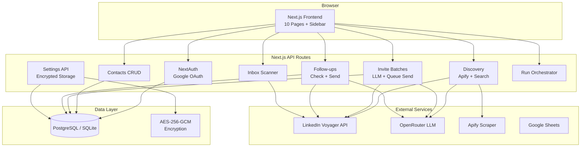

# LinkedIn Outreach Agent V0.1

Autonomous LinkedIn B2B outreach agent for **arenas.fi's Sky Protocol** $100M stablecoin liquidity facility. Manages the full daily outreach cycle: discover prospects, send personalized connection requests, track connections, send follow-ups, and detect replies — all server-side via LinkedIn's Voyager API.

## Architecture



## Tech Stack

| Layer | Technology |
|-------|-----------|
| Framework | Next.js 16 (App Router, Turbopack) |
| Language | TypeScript 5 (strict) |
| Styling | Tailwind CSS v4 + shadcn/ui |
| Auth | NextAuth.js v4 (Google OAuth, JWT) |
| Database | Prisma 7 (PostgreSQL prod / SQLite dev) |
| LLM | OpenRouter API (configurable model) |
| LinkedIn | Custom Voyager API client with rate limiting |
| Scraping | Apify (LinkedIn profile scraper) |
| Sheets | Google Sheets API v4 |

## Quick Start

```bash
git clone https://github.com/qfedesq/linkedin-outreach-agent.git
cd linkedin-outreach-agent
cp .env.example .env   # Fill in credentials
npm install
npx prisma migrate dev
npx prisma generate
npm run dev
```

Open [http://localhost:3000](http://localhost:3000) — login with a @protofire.io Google account.

## Environment Variables

| Variable | Required | Description |
|----------|----------|-------------|
| `DATABASE_URL` | Yes | `file:./dev.db` (dev) or Postgres URL (prod) |
| `GOOGLE_CLIENT_ID` | Yes | Google OAuth client ID |
| `GOOGLE_CLIENT_SECRET` | Yes | Google OAuth client secret |
| `NEXTAUTH_SECRET` | Yes | Random secret for JWT signing |
| `NEXTAUTH_URL` | Yes | App URL (`http://localhost:3000` dev) |
| `ENCRYPTION_KEY` | Yes | 32-byte hex key for AES-256-GCM |
| `NEXT_PUBLIC_APP_URL` | Yes | Public app URL |
| `DEV_BYPASS_AUTH` | No | Set `true` to skip auth in dev |

All service credentials (LinkedIn cookie, Apify, OpenRouter, Google Sheets) are configured per-user via the Settings page and stored encrypted in the database.

## Pages

| Route | Purpose |
|-------|---------|
| `/` | Dashboard — pipeline stats, quick actions, activity feed |
| `/run` | Daily cycle orchestrator with live execution log |
| `/discover` | Prospect discovery (Apify, LinkedIn search, manual add) |
| `/invites` | Invite batch prep with LLM messages + approval gate |
| `/followups` | Connection checking + follow-up messaging |
| `/responses` | Inbox scanning + reply detection |
| `/contacts` | Full contact table with search, filter, sort, export |
| `/sync` | Google Sheets import/export |
| `/logs` | Execution log viewer |
| `/settings` | Credential management with test buttons |

## API Routes

See [docs/API.md](docs/API.md) for full endpoint documentation.

## Documentation

- [Architecture](docs/ARCHITECTURE.md) — system design, data flow, DB schema
- [API Reference](docs/API.md) — all 27 endpoints
- [Deployment Guide](docs/DEPLOYMENT.md) — Vercel + Postgres setup
- [LinkedIn API](docs/LINKEDIN-API.md) — Voyager API reference
- [Contributing](CONTRIBUTING.md) — PR rules, versioning, changelog
- [Changelog](CHANGELOG.md) — version history

## License

Private — Protofire.io
