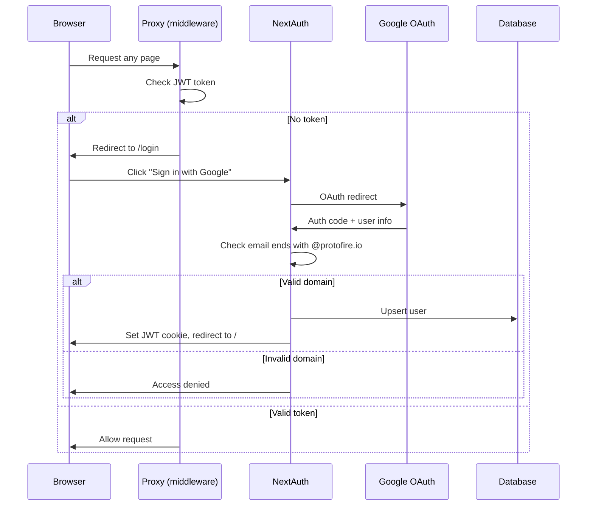
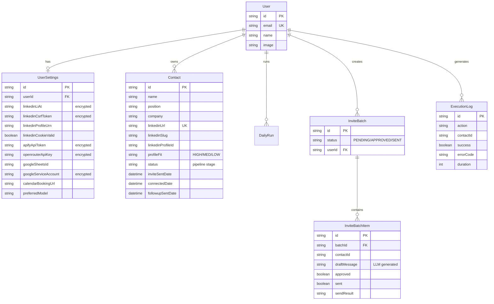

# Architecture — V0.1

## System Overview

The LinkedIn Outreach Agent is a Next.js webapp that automates B2B LinkedIn outreach. It operates as a single-tenant SaaS app where authenticated users manage a pipeline of prospects through automated connection requests and follow-up messaging.

## Data Flow

```mermaid
flowchart LR
    A[Discover] -->|Apify / Voyager Search| B[New Contacts]
    B -->|Voyager getProfile| C[Enriched Contacts]
    C -->|OpenRouter LLM| D[Scored Contacts<br/>HIGH/MED/LOW]
    D -->|OpenRouter LLM| E[Invite Batch<br/>Personalized Notes]
    E -->|User Approval| F[Send Invites<br/>via Voyager API]
    F -->|Rate Limited<br/>30-60s gaps| G[Invited Contacts]
    G -->|Voyager checkConnection| H{Connected?}
    H -->|Yes, 3+ days| I[Follow-up<br/>via Voyager Message]
    H -->|No, 30+ days| J[Unresponsive]
    I -->|Voyager Inbox Scan| K{Reply?}
    K -->|Yes| L[Meeting Booked]
    K -->|No, 14+ days| J
```



## Authentication Flow



## Database Schema (ERD)



## Security Architecture

- **Auth**: Google OAuth with @protofire.io domain restriction
- **Sessions**: JWT strategy (stateless, no session DB)
- **Credentials**: AES-256-GCM encrypted at rest (12-byte IV, 16-byte auth tag)
- **Proxy**: All routes except `/login`, `/api/auth`, `/_next` require valid JWT
- **Rate Limiting**: Token bucket per endpoint type (invitations: 30-60s, profiles: 2.4-3.6s)
- **Daily Cap**: Hard limit of 20 invites per day, enforced at DB level

## Project Structure

```
src/
├── app/
│   ├── layout.tsx                    # Root: fonts, metadata, Providers
│   ├── login/page.tsx                # Login page
│   ├── (dashboard)/
│   │   ├── layout.tsx                # Sidebar + TopBar wrapper
│   │   ├── page.tsx                  # Dashboard
│   │   ├── contacts/page.tsx
│   │   ├── discover/page.tsx
│   │   ├── invites/page.tsx
│   │   ├── followups/page.tsx
│   │   ├── responses/page.tsx
│   │   ├── run/page.tsx
│   │   ├── sync/page.tsx
│   │   ├── logs/page.tsx
│   │   └── settings/page.tsx
│   └── api/                          # 27 API routes
├── components/
│   ├── layout/ (sidebar, topbar)
│   ├── providers.tsx
│   └── ui/ (19 shadcn components)
├── lib/
│   ├── auth.ts                       # NextAuth config
│   ├── auth-helpers.ts               # getAuthUser, unauthorized
│   ├── constants.ts                  # APP_VERSION, APP_NAME
│   ├── encryption.ts                 # AES-256-GCM
│   ├── prisma.ts                     # DB client factory
│   ├── llm.ts                        # OpenRouter + prompts
│   ├── sheets.ts                     # Google Sheets API
│   └── linkedin/                     # Voyager API client
│       ├── client.ts, profiles.ts, invitations.ts
│       ├── messaging.ts, connections.ts, search.ts
│       ├── rate-limiter.ts, types.ts
│       └── index.ts
└── proxy.ts                          # Auth middleware
```
